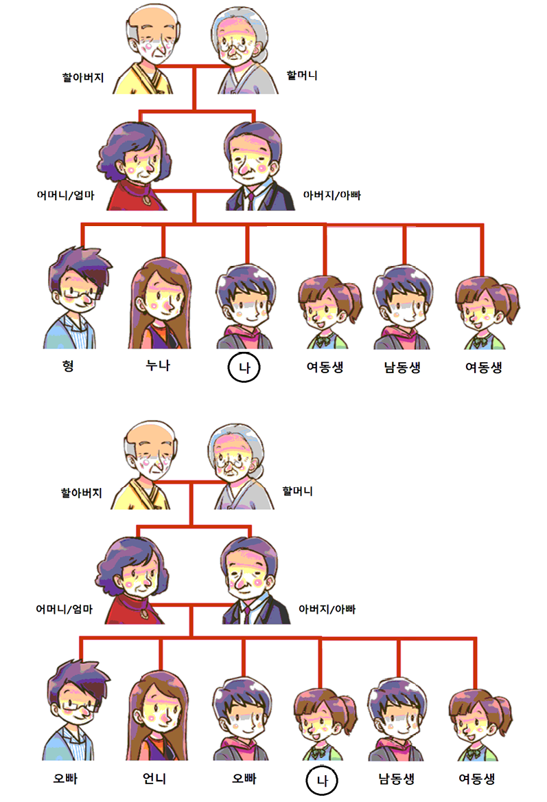

# 👨‍👩‍👧‍👦 Familie

  

| Koreanisch       | Aussprache     | Deutsch                          |
|------------------|----------------|----------------------------------|
| 가족             | gajok          | Familie                          |
| 부모님           | bumonim        | Eltern                           |
| 아버지           | abeoji         | Vater                            |
| 어머니           | eomeoni        | Mutter                           |
| 아빠             | appa           | Papa                             |
| 엄마             | eomma          | Mama                             |
| 할아버지         | harabeoji      | Großvater / Opa                  |
| 할머니           | halmeoni       | Großmutter / Oma                 |
| 형제             | hyeongje       | Geschwister                      |
| 형               | hyeong         | älterer Bruder (für Männer)      |
| 오빠             | oppa           | älterer Bruder (für Frauen)      |
| 누나             | nuna           | ältere Schwester (für Männer)    |
| 언니             | eonni          | ältere Schwester (für Frauen)    |
| 동생             | dongsaeng      | jüngerer Bruder / Schwester      |
| 남동생           | namdongsaeng   | jüngerer Bruder                  |
| 여동생           | yeodongsaeng   | jüngere Schwester                |
| 남편             | nampyeon       | Ehemann                          |
| 아내             | anae           | Ehefrau                          |
| 와이프           | waipeu         | Ehefrau (umgangssprachlich)      |
| 집사람           | jipsaram       | Ehefrau (formell, traditionell)  |
| 아들             | adeul          | Sohn                             |
| 딸               | ttal           | Tochter                          |

